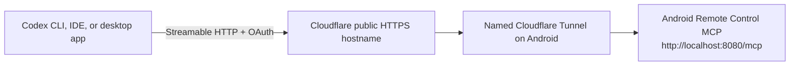

# Connect Codex through a Cloudflare Tunnel

This guide connects a local Codex client to Android Remote Control MCP through a
public Cloudflare Tunnel hostname. The recommended authentication method is the
app's built-in OAuth 2.1 server. A static bearer token is supported as a
fallback.

The resulting connection path is:



Codex connects to the MCP endpoint, not to Chrome DevTools Protocol (CDP), ADB,
or the Cloudflare dashboard. Never expose a browser debugging port such as
`9222` for this integration.

## Prerequisites

- Android Remote Control MCP is installed and its Accessibility Service is
  enabled.
- The MCP server is running on the Android device.
- OAuth is enabled under **Settings -> Access**.
- A Cloudflare Quick Tunnel or named tunnel is active.
- The public hostname routes to the app's local HTTP service. For the default
  port, configure the Cloudflare published application as:

  ```text
  Public hostname: PHONE_HOSTNAME
  Service:         http://localhost:8080
  ```

- The public endpoint is therefore:

  ```text
  https://PHONE_HOSTNAME/mcp
  ```

Replace `PHONE_HOSTNAME` throughout this guide with the hostname displayed in
the app or configured in the Cloudflare dashboard. Do not append the Cloudflare
tunnel token to the URL. The tunnel token authenticates the `cloudflared`
process to Cloudflare; it is not an MCP credential.

## Recommended setup: OAuth

OAuth creates a separate, revocable client registration on the Android device
and avoids copying the app's long-lived bearer token into Codex configuration.

Add the Streamable HTTP server:

```bash
codex mcp add android-phone --url https://PHONE_HOSTNAME/mcp
```

Start OAuth login:

```bash
codex mcp login android-phone
```

Codex should discover the authorization server and select Dynamic Client
Registration (DCR) automatically. To select the known-compatible registration
method and scopes explicitly, use:

```bash
codex mcp login android-phone \
  --oauth-client-registration dcr \
  --scopes mcp,offline_access
```

During login:

1. Codex opens the authorization flow in a browser.
2. A two-digit verification code is displayed.
3. On the Android device, open the OAuth approval notification. If notification
   permission is disabled, open the pending approvals card on the app's Server
   screen instead.
4. Confirm that both codes match, then approve the request.
5. The client appears under **Settings -> Access -> Connected clients**, where
   it can be revoked later.

Run the login command in the same local environment in which Codex runs. This
is especially important with WSL or a remote development environment because
the OAuth flow redirects the browser to a loopback callback owned by Codex.

## Recommended Codex policy

Codex stores MCP configuration in `~/.codex/config.toml`. The CLI commands above
create the server entry; it can then be tightened as follows:

```toml
[mcp_servers.android-phone]
url = "https://PHONE_HOSTNAME/mcp"
enabled = true
required = false
default_tools_approval_mode = "prompt"
tool_timeout_sec = 120
```

No `auth = "oauth"` entry is needed. Codex discovers OAuth from the server's
protected-resource metadata, while `codex mcp login android-phone` performs the
login and stores the resulting credentials separately from `config.toml`.

The settings intentionally use:

- `required = false`, so an offline phone or stopped tunnel does not prevent
  Codex from starting.
- `default_tools_approval_mode = "prompt"`, because the server can control the
  screen, launch apps, read and write files, use the camera, and interact with
  notifications.
- `tool_timeout_sec = 120`, allowing enough time for longer Android operations.

Do not copy OAuth access or refresh tokens into `config.toml`. Codex manages its
stored OAuth credentials separately.

`default_tools_approval_mode` controls confirmation prompts for MCP tool calls;
it does not configure the connection or authentication:

- `auto` uses the MCP tool annotations (`readOnlyHint`, `destructiveHint`, and
  `openWorldHint`) to decide whether a confirmation is required.
- `prompt` requests confirmation for every tool call.
- `writes` runs only tools explicitly annotated as read-only without prompting
  and requests confirmation for the rest.
- `approve` runs all tools from this server without an MCP confirmation prompt.

`approve` is the broadest mode. Use it only when the server and every exposed
tool are trusted. This project currently does not publish MCP safety annotations,
so `auto` and `writes` conservatively require confirmation for its tools. For a
phone-control server, `prompt` is the recommended starting point.

The local deployment documented in this repository deliberately grants full
access to both trusted phones:

```toml
[mcp_servers.android_xiaomi11t]
url = "[REDACTED_OWNER_VALUE]"
default_tools_approval_mode = "approve"

[mcp_servers.android_[REDACTED_DEVICE_ALIAS]]
url = "[REDACTED_OWNER_VALUE]"
default_tools_approval_mode = "approve"
```

There is no `enabled_tools` allow list or `disabled_tools` deny list, so Codex
loads every tool exposed by each server. OAuth credentials are stored separately
by Codex after `codex mcp login`; they must not be copied into this file.

Put the entry in `~/.codex/config.toml` when the phone should be available to all
Codex projects for the current user. To limit access to one trusted repository,
put the same entry in that repository's `.codex/config.toml` instead. Project
configuration is loaded only for trusted projects. Restart Codex or start a new
session after changing either file so its MCP tool inventory is rebuilt.

## Verify the connection

Check that the server is configured:

```bash
codex mcp list
codex mcp get android-phone
```

Then restart the Codex desktop app or IDE extension, or start a new Codex CLI
session. An MCP server added while a session is running does not appear in that
session's existing tool inventory.

In a new Codex TUI session, run:

```text
/mcp
```

The connected tool list should contain names beginning with `android_`. If the
app has a device slug, the prefix is `android_<slug>_` instead.

The public OAuth discovery endpoints can also be checked without credentials:

```bash
curl -fsS https://PHONE_HOSTNAME/.well-known/oauth-protected-resource/mcp
curl -fsS https://PHONE_HOSTNAME/.well-known/oauth-authorization-server
```

The protected-resource document should identify
`https://PHONE_HOSTNAME/mcp`. The authorization-server document should include
the `/authorize`, `/token`, and `/register` endpoints and advertise PKCE `S256`.

An unauthenticated request to `/mcp` returning HTTP `401` is expected. It proves
that the route is reachable and authentication is enforced; it does not mean
that the tunnel is broken.

## Bearer-token fallback

Use a bearer token only when OAuth cannot be used. Keep the token out of the
repository and `config.toml`; inject it through the environment of the process
that starts Codex.

```bash
codex mcp add android-phone \
  --url https://PHONE_HOSTNAME/mcp \
  --bearer-token-env-var ANDROID_PHONE_MCP_TOKEN
```

Equivalent configuration:

```toml
[mcp_servers.android-phone]
url = "https://PHONE_HOSTNAME/mcp"
bearer_token_env_var = "ANDROID_PHONE_MCP_TOKEN"
enabled = true
required = false
default_tools_approval_mode = "prompt"
tool_timeout_sec = 120
```

Set `ANDROID_PHONE_MCP_TOKEN` in a local secret manager, service environment, or
shell before starting Codex. Do not put the literal token in shell history or a
tracked file. Restart Codex after changing its environment.

## Troubleshooting

### `401 Authentication required`

This is normal before OAuth login. Run `codex mcp login android-phone`, approve
the matching code on the device, and start a new Codex session.

### No approval appears on Android

Check that OAuth is enabled and the MCP server and tunnel are running. Look for
the pending approvals card on the app's Server screen if notification permission
is disabled.

### OAuth callback does not complete

Run `codex mcp login` from the same WSL, container, remote host, or local machine
that runs Codex. If loopback forwarding is restricted, configure a fixed
`mcp_oauth_callback_port` or `mcp_oauth_callback_url` as described in the
[official Codex MCP documentation](https://developers.openai.com/codex/mcp).

### Cloudflare hostname responds, but `/mcp` does not

Verify all three values:

- the Codex URL ends in `/mcp`;
- the Cloudflare published application points to
  `http://localhost:<app-port>`;
- the app's server port matches the Cloudflare service port.

Cloudflare terminates public TLS. For the normal tunnel configuration, its
origin service is the app's local HTTP endpoint, not a self-signed HTTPS URL.

### Codex starts slowly or fails while the phone is offline

Keep `required = false`. This makes the phone optional at Codex startup while
leaving the server available whenever the tunnel reconnects.

## Security notes

- Keep OAuth or bearer authentication enabled whenever the tunnel is public.
- Prefer OAuth so each Codex installation has a separately revocable client.
- Confirm the two-digit OAuth code only for a login you initiated.
- Keep `default_tools_approval_mode = "prompt"` until the enabled tools and their
  effects have been reviewed.
- The documented `[REDACTED_DEVICE_ALIAS]` and `[REDACTED_DEVICE_ALIAS]` entries intentionally use `approve` at the
  owner's request, which gives Codex all available phone-control actions without
  per-call MCP confirmation.
- Do not publish the Cloudflare tunnel token, MCP bearer token, OAuth tokens, or
  browser CDP endpoint.
- Stop the server and tunnel when remote control is not needed.

For general Codex MCP configuration and supported options, see the
[official OpenAI documentation](https://developers.openai.com/codex/mcp).
